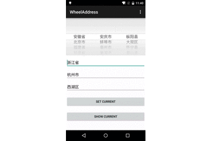

# WheelAddress

base on android wheel 



# Usage

```groovy
dependencies {
    compile 'com.github.wzq.wheel:wheel-lib:1.0.0'
}
```

Create a wheel view. Put resource file under assets. Like assets/[RESOURCE NAME].xml

```java
  WheelHelper wheelHelper = new WheelHelper(this, [RESOURCE NAME]);
  wheelHelper.getView();
```

Get current value.

```java
  Address address = wheelHelper.getCurrent();
```

Set current value.

```java
    wheelHelper.setCurrent(WheelHelper.TYPE_PROVINCE, "";
    wheelHelper.setCurrent(WheelHelper.TYPE_CITY, "");
    wheelHelper.setCurrent(WheelHelper.TYPE_DISTRICT, "");
```
